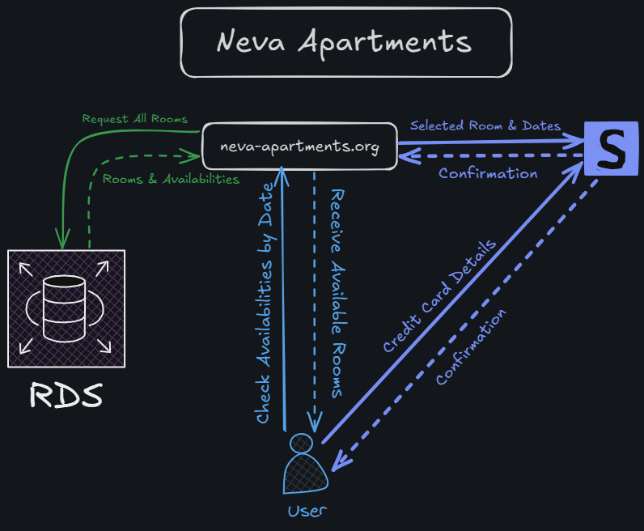
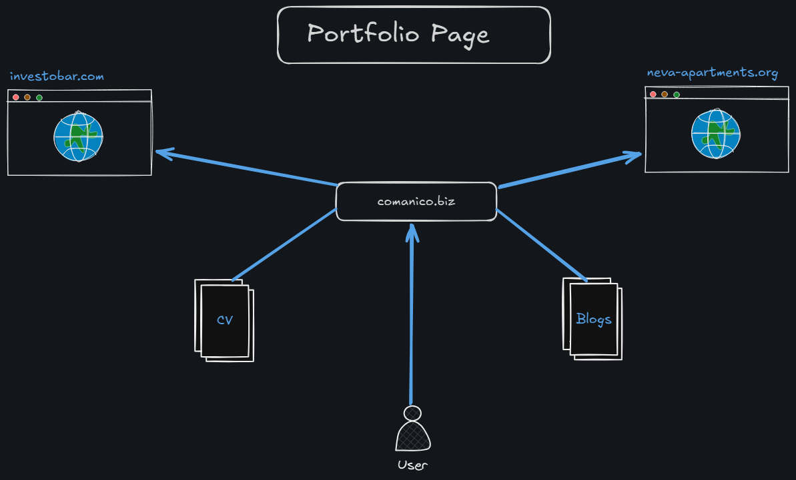
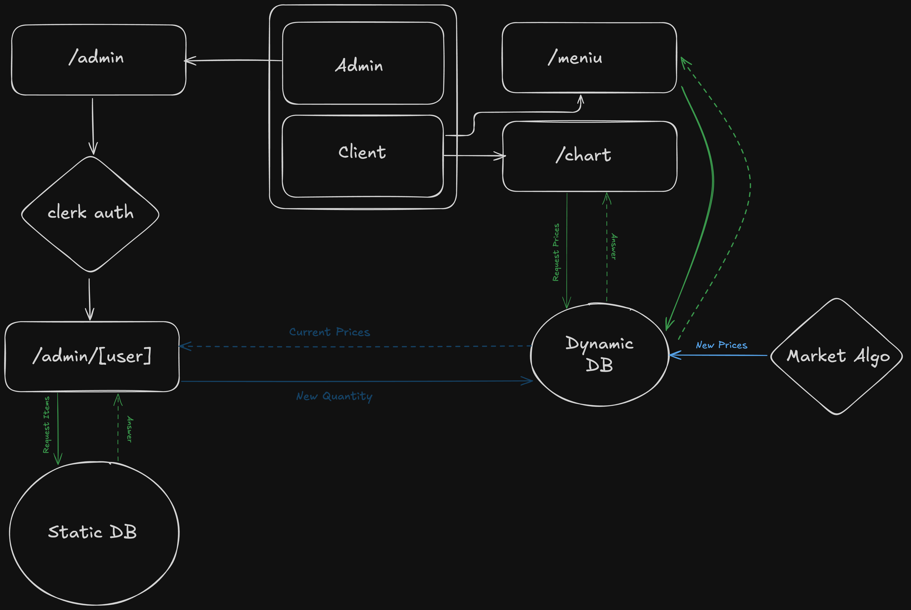

# Journey So Far

I’ve been an employee at a major financial institution for 5 years. 
In these years, I did not learn any language or tech to my core, but rather I learned how to be able to understand each language and new technology fairly quickly in order to be able to create a project I had in mind. 
So the confidence was there, therefore I started to work on my own projects, which I’ll go through right now.
This is not supposed to be a technical blog, rather an overview of the accomplishments within 6 months. Each project deserves its own post, considering the need to explain each decision made within the project.

## Neva Apartments
**An Airbnb like app, where you can find available rooms for hotels owned by a small family business. This is advantageous from a business point of view, because you're eliminating all the fees from Airbnb, Booking etc.**

This would be my first serious Typescript project, so I was eager for the challenge. For most of the projects I worked, I first started to follow a tutorial that would fit my needs, then I’d adapt the final project from said tutorial to my own. 

For this case I followed [Chaoo Charles tutorial](https://www.youtube.com/watch?v=5VHANL_wIL4&t=11242s) on how to build a hotel app. Once I finished the tutorial I added pictures from the small business I was working for, changed the colors of the app and that was the final project.

What I added to the project was, hosting the domain by using AWS Route 53 domain and connecting it with Vercel. The additional feature I added was having the app connect to a DB hosted on AWS RDS in order to keep track of the bookings made at the hotel. 

The best part of this project was learning how to use Stripe. Always wondered how these payments are made on these apps, turns out it’s easier than it looks like. Stripe’s pre-built checkout and clear API made payments surprisingly easy

## Comanico.Biz

**A site containing my accomplishments, CV, projects and blog. It's good to centralize your work in order for people to have a clear image of you and what you're offering,**

Once I created my first functional app, I realized that I wanted to track my progress of all the projects that I’m building for following reasons:
 - To keep evidence of my mistakes and be able to go back to them when needed, like a troubleshooting guide
 - To help others going through same mistakes
 - To have a presentation for future opportunities 

Similar to previous project, this project was also built based on a tutorial from [Cristian Mihai](https://www.youtube.com/watch?v=dImgZ_AH7uA&t=10861s). 

The final project closely resembles the one from the tutorial, just added my own text, pictures, links. 

The only addition I added is this blog, from where you’re currently reading.

## Investo Bar

**An app built for a concept where prices of drinks from a bar are affected by the purchase from consumers. eg. If there are beers at 5$ and wine at 10$, if people buy only beer, the beer price will increase to 11$, while wine will decrease to 9$. This project was built in order to gamify the stock market to non financial people in order to narrow the financial knowledge gap.**
This was the actual first project that was started from scratch. 

From scratch in this case means, that I had to envision how the application would work and look. 

There was also a time constraint considering it’s a startup and the mentality was, that the faster we have a product, the more real the project feels. 

So in a span of 2 weeks I’ve built a presentation site for the project and a chart of the prices which was for external users. 

Then came the architecture, where I had to reserve a server for a R script to run our algorithm to provide new prices. 

There is a Python script which checks for updates from the R script and updates the data on a AWS Cloudfront Cache registry. 

The UI chart would then update from Cloudfront chart.

## Looking Ahead
Now writing this, it's easy to realize how far one can go if you focus on solving each small task. 

Each task is like a puzzle piece, you find its place and it completes the big picture.

Looking forward to see what the journey provides in the upcoming 6 months.