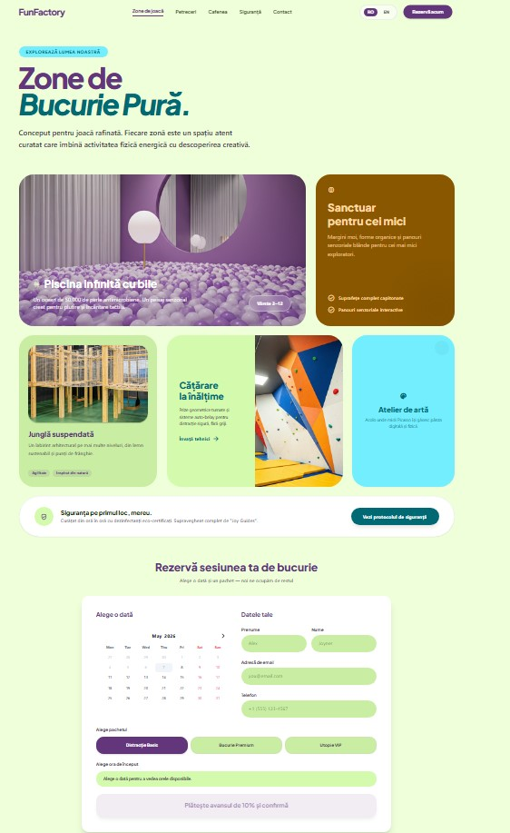

---
slug: fun-factory
title: Fun Factory
description: A Modern Party Booking Platform for Kids
date: 2026-05-07T12:00:00Z
published: true
tags: [fullstack, typescript, railway, portfolio, startup]
---

# Introduction

A new playground is opening up, with features not common in the area. A ball pit, canons where the balls are being shot out from, slides, adventure and climbing area, every childs dream space.
But this is not just a playground, it's also a space where parents can relax together while their children have fun. The best of both worlds.

## Challenge

Parents want **one place** where their kids can go wild and they can actually relax.  
So what is this place missing?
The physical space was ready — but the digital side was missing:

- No easy way to see availability  
- No clear party packages (2h / 4h / All Day)  
- Manual phone bookings → chaos  
- No professional online presence

## Solution

A **modern, fast, beautiful** website using **Next.js 15 (App Router), TypeScript, Tailwind CSS, and Prisma + MySQL**.

# Building the Webpage

From a technological point of view, this project does not require many features. A standard presentation page for potential clients to know what's going on at FunFactory, what are the safety procedures and a form in case there are any questions.
The more "complex" feature this app has is a scheduling system, with a calendar built through Vanilla Calendar JS, which stores reservations in a MySQL DB. The reservation requires from client to make a deposit via Stripe,  in order to confirm the reservation.

## User Interface

Considering now that there are many AI design tools, I used this opportunity to test one of them. For this case I used [Stitch by Google](https://stitch.withgoogle.com/). 
While this app is currently in beta mode, it was very useful in speeding up the design process. I gave an example of a website I wanted to mimic, what sections the menu should have and it generated what we see now in below image. 

Once the design was mostly generated and modified through Figma to get it to a point where I was satisfied with it, I started to create the UI using React TypeScript.

## User Experience

What's most important for this project is for the client to have the easiest path in order to book a party at FunFactory.
Therefore, at the top of the page, there is a "Reserve Now" button which routes user directly to the calendar. The user can then select a preferred party package, date and time. It's important that a valid email address is used so that the app can send a confirmation email.

# Technology

The app was built using only React Typescript with NextJS, together with Prisma to communicate with the database. 
Project is built on Railway, an affordable platform where one can deploy a project from Github along with various software technologies, such as MySQL.

# Conclusion

Considering this as the fourth project from my portfolio, it shows how easier it got as I've gotten more experience. 
Looking forward to the next one!