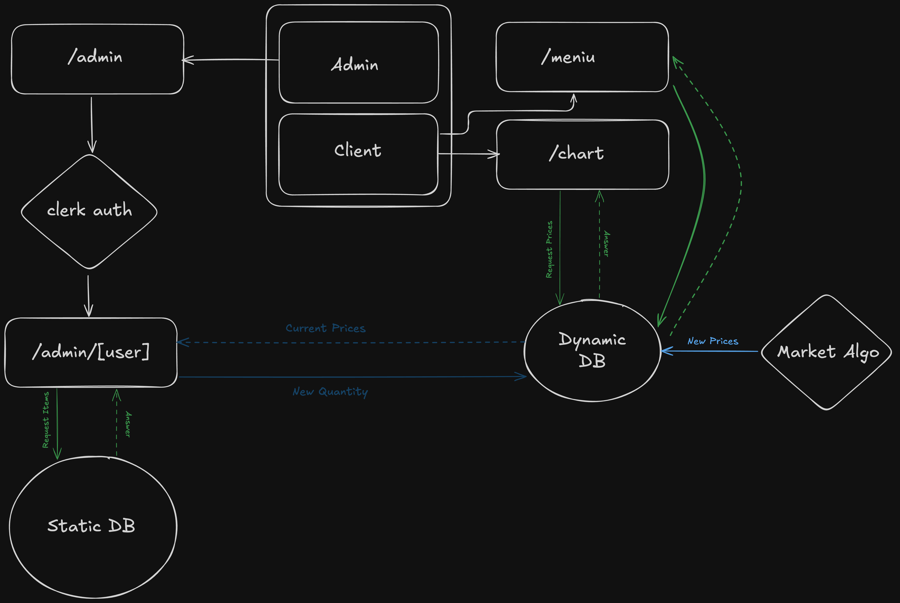

# Idea

The idea was born when one of our group discovered "Stock Market Bars" in Germany — places where drink prices fluctuate based on real-time demand, just like stocks.

We saw a unique opportunity: **bring the stock market to Romania** in a familiar, social setting.  
Instead of complex charts and intimidating terminology, people would learn financial concepts while having a beer with friends. Popular drinks get more expensive. Less popular ones become cheaper. Every 15 minutes the market updates, creating a living, breathing demonstration of supply and demand.

### How It Works

1. The bar offers a fixed set of products (beer, wine, soft drinks, etc.)
2. Prices change dynamically every 15 minutes based on actual purchases
3. Popular items become more expensive, less popular ones get cheaper
4. This creates a real supply-and-demand environment in a relaxed social context

# Why Now

[Financial education in Romania ranks among the lowest in the EU](https://europa.eu/eurobarometer/surveys/detail/2953). 
[Whilst the number of investors are growing year-over-year](https://startupcafe.ro/record-de-investitori-la-bursa-de-valori-bucuresti-26-intr-un-an-de-ce-multi-romani-aleg-insa-titlurile-de-stat-95922), the total still shows that majority of people are hesitant when it comes to investing.

# Goal

We are not building another bar, rather Romania's first experential financial education platform.
By turning a bar into a living market, people can actively participate, make decisions, see consequences, and naturally understand core economic principles like supply and demand, market sentiment, risk, and crisis management.
Beyond the bar itself, we plan to host educational events and talks where guests can learn about real investing in an engaging way.

# Technology

The system is built with a modern, scalable full-stack architecture.

- **Frontend**: TypeScript/React application that displays live prices and allows authorized users to manage the system.
- **Backend**: Python pricing engine that calculates new prices using an Exponential Moving Average (EMA) model.
- **Database**: MySQL for storing raw sales data.
- **Storage**: S3 for price history and the final aggregated `live_prices.json` consumed by the frontend.
- **Infrastructure**: Deployed on Railway with separate services for the UI and automated pricing cycles.

# Algorithm

## Core Concept

Traditional stock markets move at high frequency. 
In a bar, purchase frequency is much lower, which is why we embeded a popular algorith called Exponential Moving Average (EMA), to have the bar act like an actual stock market.
EMA helps give more importance to recent sales, rather than old ones. Thus the pricing engine will be more responsive to sudden changes in client behavior. 

## Algorithm Engine

### 1. Exponential Moving Average (EMA)

- **EMA on Volumes** — tracks recent sales volume of each product
- **EMA on Shares** — measures relative popularity among products
- Popular items become more expensive. Less popular items get cheaper.
- Built-in safeguards prevent extreme swings and trigger a **market reset** (crisis mode) if any product becomes unreasonably expensive.

This creates a real, dynamic market that customers can feel and understand immediately.

### 2. Crisis Detection
If any product’s price exceeds a sfae threshold (currently 2x base price), a crisis is triggered and all prices are reset to base levels to restore market balance and prevent unrealistic spikes.

### Final Closing

**InvestoBar is more than a bar.**

It is a new way to teach finance — one beer at a time.  
By combining entertainment, real economics, and technology, we are creating a meaningful social impact in a country that urgently needs better financial education.